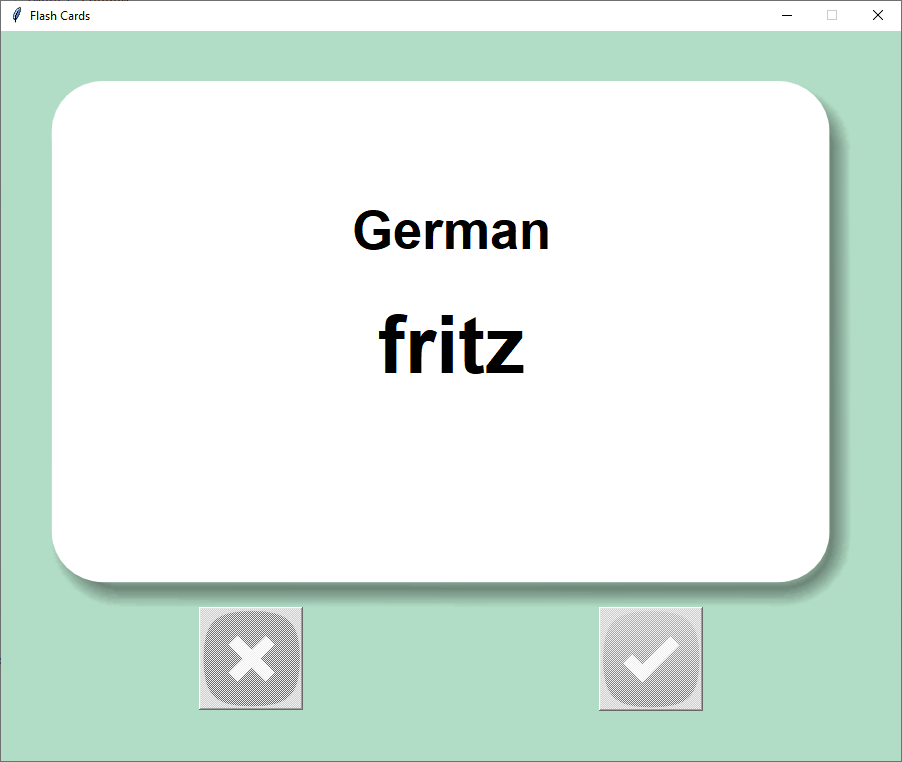

# 🇩🇪 German Flash Cards 🚀

[](https://www.python.org/)
[](https://github.com/masood2004/flash_card_project/blob/main/LICENSE)

An interactive flash card application designed to help users learn German vocabulary efficiently using spaced repetition.

 <!-- You can add actual screenshot/gif here -->

## ✨ Features

- 🃏 Interactive flash cards with German-English word pairs
- ⏳ Automatic card flip after 3 seconds to reveal translation
- ✅ Mark words as learned to filter them out
- 💾 Progress saving using CSV files
- 🎨 Clean UI with card flip animation
- 📱 Responsive design with fixed window size
- 🔄 Dynamic word loading from multiple sources

## 📦 Installation

1. Clone the repository:
```bash
git clone https://github.com/masood2004/flash_card_project.git
```

2. Install dependencies:
```bash
pip install pandas
```

3. Run the application:
```bash
python flash_card_app.py
```

## 🎮 Usage

- Click the ❌ button to see a new word
- Click the ✅ button to mark a word as learned
- Words marked as learned are moved to `words_to_learn.csv`
- Application starts with `german_words.csv` as default dataset
- Cards automatically flip after 3 seconds to show translation

## 📂 Repository Structure

```
📁 flash_card_project/
├── 📁 data/
│   ├── german_words.csv       # Default vocabulary database
│   └── words_to_learn.csv     # Generated file for remaining words
├── 📁 images/
│   ├── card_back.png          # Back side of flash card
│   ├── card_front.png         # Front side of flash card
│   ├── wrong.png              # Wrong button icon
│   └── right.png              # Right button icon
├── flash_card_app.py          # Main application file
├── LICENSE
└── README.md
```

## 🔧 Technical Details

- **Built With**:
  - Python 3.8+
  - Tkinter (GUI)
  - Pandas (Data handling)
  - Random module (Word selection)

- **Color Scheme**:
  - Background: `#B1DDC6` (Light Teal)
  - Card Front: White with black text
  - Card Back: Green with white text

## 🤝 Contributing

Contributions are welcome! Please open an issue first to discuss what you'd like to change.

## 📜 License

This project is licensed under the MIT License - see the [LICENSE](LICENSE) file for details.

---

Made with ❤️ by [Masood](https://github.com/masood2004) • Happy Learning! 🇩🇪➡️🇬🇧
